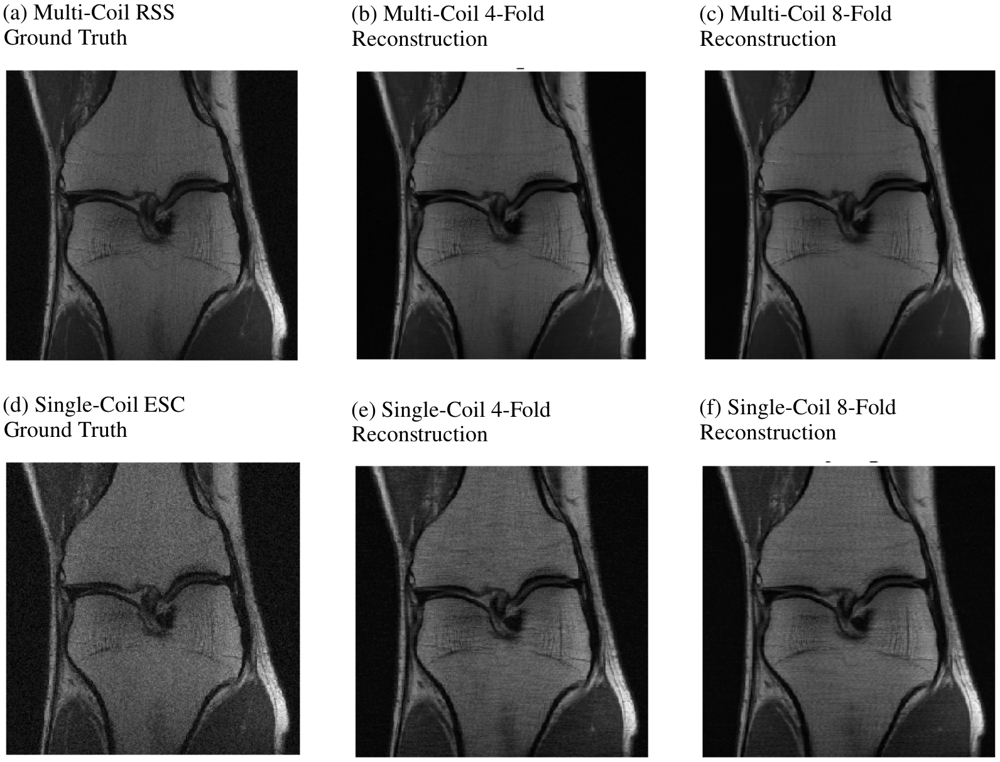

# i-RIM for fastMRI 
Official implementation of the i-RIM applied to the [fastMRI dataset](https://fastmri.org)
as described in [*Invert to Learn to Invert*](http://papers.nips.cc/paper/8336-invert-to-learn-to-invert)
and [*i-RIM applied to the fastMRI challenge*](https://arxiv.org/abs/1910.08952).


See some example reconstructions here:




And some numbers:

|                                                                        |       ~------| 4x |------~         |         ~------| 8x |------~     |
| :--------------------------------------------------------------------- | :-----------------: | :---------------: | :---------------: | :-----------------: | :---------------: | :---------------: |
| **i-RIM single-coil**| NMSE | PSNR | SSIM | NMSE | PSNR | SSIM |
| Validation |     0.0342      |     32.43     |     0.751     |     0.0446      |     30.92     |     0.692     |
| Test       |     0.0272      |     33.65     |     0.781     |     0.0421      |     30.56     |     0.687     |
| Challenge  | n/a | n/a | n/a | 0.031 | 33 | 0.754 |
| **i-RIM multi-coil** | NMSE | PSNR | SSIM | NMSE | PSNR | SSIM |
| Validation |     0.0062      |     38.84     |     0.916     |     0.0103      |     36.19     |     0.886     |
| Test       |     0.0052      |     39.52     |     0.928     |     0.0093      |     36.53     |     0.887     |
| Challenge  |     0.006      |     39     |    0.925    |   0.010   |   37   |   0.899   |


### Installation
To use this code, please run the following commands (preferably in a virtualenv):
```bash
git clone --recurse-submodules https://github.com/pputzky/irim_fastMRI.git
cd irim_fastMRI
pip install -r requirements.txt
./install.sh
```

The above commands will clone this repository with all submodules. 
Running `./install.sh` will install [irim](https://github.com/pputzky/invertible_rim)
as a package in your current Python environment.

### Usage
This repository includes two scripts that allow training (`scripts.train_model`) 
and running (`scripts.run_model`) of an i-RIM. Both scripts are derived from the
train and run scripts in the [fastMRi code base](https://github.com/facebookresearch/fastMRI).

To train models as used in our fastMRI challenge submission
(see [*i-RIM applied to the fastMRI challenge*](https://arxiv.org/abs/1910.08952)),
run the following commands (make sure to set `$DATA_PATH` and `$CHECKPOINT_PATH` before) :

#### Single-coil
##### Train the model
```bash
python -m scripts.train_model \
--challenge singlecoil --batch_size 8 --n_steps 8 \
--n_hidden 64 64 64 64 64 64 64 64 64 64 64 64 \
--n_network_hidden 64 64 128 128 256 1024 1024 256 128 128 64 64 \
--dilations 1 1 2 2 4 8 8 4 2 2 1 1 \
--multiplicity 4 --parametric_output \
--loss ssim --resolution 320 --train_resolution 368 368 --lr_gamma 0.1 \
--lr 0.0001 --lr_step_size 30 --num_epochs 50 --optimizer Adam \
--num_workers 8 --report_interval 100 --data_parallel --resume \
--data-path $DATA_PATH --exp_dir $CHECKPOINT_DIR 
```
##### Run the model
```bash
python -m scripts.run_model --challenge singlecoil --batch-size 8 \
--data-path $DATA_PATH --checkpoint $CHECKPOINT_DIR/best_model.pt \
--out-dir $OUTPUT_DIR --data-split val
```
##### Evaluate reconstructions
```bash
python -m external.fastMRI.common.evaluate --challenge singlecoil \
--target-path $DATA_PATH/singlecoil_val/ --predictions-path $OUTPUT_DIR
```

#### Multi-coil
```bash
python -m scripts.train_model \
--challenge multicoil --batch_size 32 --n_steps 8 \
--n_hidden 96 96 96 96 96 96 96 96 96 96 96 96 \
--n_network_hidden 64 64 128 128 256 1024 1024 256 128 128 64 64 \
--dilations 1 1 2 2 4 8 8 4 2 2 1 1 \
--multiplicity 1 --parametric_output \
--loss ssim --resolution 320 --train_resolution 368 368 --lr_gamma 0.1 \
--lr 0.0001 --lr_step_size 30 --num_epochs 50 --optimizer Adam \
--num_workers 8 --report_interval 100 --data_parallel --resume \
--data-path $DATA_PATH --exp_dir $CHECKPOINT_DIR 
```
Running and evaluating as above.
#### RIM baseline on single-coil
```bash
python -m scripts.train_model \
--use_rim --challenge singlecoil --batch_size 8 --n_steps 8 \
--loss ssim --resolution 320 --train_resolution 368 368 --lr_gamma 0.1 \
--lr 0.0001 --lr_step_size 30 --num_epochs 50 --optimizer Adam \
--num_workers 8 --report_interval 100 --data_parallel --resume \
--data-path $DATA_PATH --exp_dir $CHECKPOINT_DIR 
```
Running and evaluating as above.

### References
If you use this code or derivatives thereof, please cite the following works
```bibtex
@incollection{pputzky2019,
title = {Invert to Learn to Invert},
author = {Putzky, Patrick and Welling, Max},
booktitle = {Advances in Neural Information Processing Systems 32},
editor = {H. Wallach and H. Larochelle and A. Beygelzimer and F. d\textquotesingle Alch\'{e}-Buc and E. Fox and R. Garnett},
pages = {444--454},
year = {2019},
publisher = {Curran Associates, Inc.},
url = {http://papers.nips.cc/paper/8336-invert-to-learn-to-invert.pdf}
}
```

```bibtex
@misc{pputzky2019fastMRI,
    title={i-RIM applied to the fastMRI challenge},
    author={Patrick Putzky and Dimitrios Karkalousos and Jonas Teuwen and Nikita Miriakov and Bart Bakker and Matthan Caan and Max Welling},
    year={2019},
    eprint={1910.08952},
    archivePrefix={arXiv},
    primaryClass={eess.IV}
}
```
